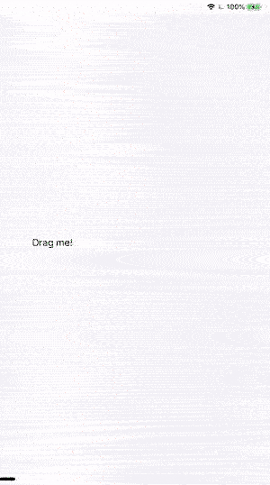

# UITableView-drop-bug
A bug in iOS 13 where UITableView stops responding to drop interaction

## Description

If a new drag & drop interaction follows a previous drop operation close enough, `UITableView` stops tracking it, even though the dragged items are hovering above the table view. The only way to get the table view start tracking the drag session again, is moving outside of the table view's bounds and then back above the table.

Demonstration:

