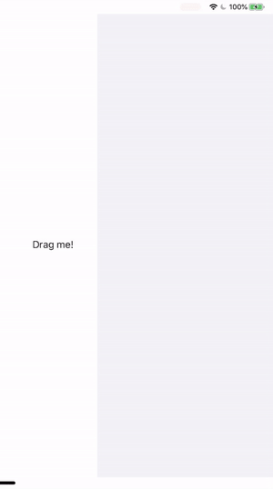

# UITableView-drop-bug
A bug in iOS 13 where UITableView stops responding to drop interaction

## Description

If a new drag & drop interaction follows a previous drop operation close enough, `UITableView` stops tracking it, even though the dragged items are hovering above the table view. The only way to get the table view start tracking the drag session again, is moving outside of the table view's bounds and then back above the table.

Demonstration:



## Steps to reproduce

1. Clone this project
1. Run the `UITableViewDropBug` target
1. Drag the view labelled "Drag me!" to the table view a few times, thus filling the table with rows. 
1. When finishing a previous drop, immediately initiate a new drag interaction and drag the item over the table view as quickly as possible.
1. The table view might make some glitchy transition and then the drag session will no longer be tracked by the table view. If you now release the dragged item, the interaction will be cancelled without inserting the next row into the table. However if you now drag the item outside the bounds of the table view, and re-enter the table view's bounds, the drag session will get tracket correctly. 

## Workaround

Covering the table view with another view for a brief moment seems to trigger the table view to restart tracking the drag interaction. This has to be done when the previous drop animations have finished:

```
    func tableView(_ tableView: UITableView, performDropWith coordinator: UITableViewDropCoordinator) {
        let row = coordinator.destinationIndexPath?.row ?? items.count
        items.insert("Item \(items.count)", at: row)

        tableView.performBatchUpdates({
            tableView.insertRows(at: [[0, row]], with: .automatic)
        }, completion: nil)
        coordinator.drop(coordinator.items[0].dragItem, toRowAt: [0, row]).addCompletion { phase in
            guard phase == .end else { return }
            guard tableView.hasActiveDrop else { return }

            let tableViewDropBugWorkaroundView = UIView(frame: tableView.frame)
            tableView.superview?.addSubview(tableViewDropBugWorkaroundView)
            Timer.scheduledTimer(withTimeInterval: 0.05, repeats: false) { [weak tableViewDropBugWorkaroundView] _ in
                tableViewDropBugWorkaroundView?.removeFromSuperview()
            }
        }
    }
```

(In case you have multiple items dropping into the table, attach a completion block to each animation and use a countdown latch to trigger the workaround once all the animations have finished)

## Bug report

Reported to Apple as FB7545138.
